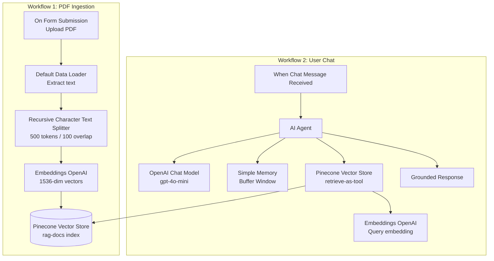

# RAG-Powered Policy Q&A with n8n and Pinecone

## Overview

This project implements a Retrieval-Augmented Generation (RAG) system that allows users to ask natural language questions about a company policy document and receive accurate, grounded answers. Built using n8n workflow automation, Pinecone vector database, and OpenAI's language and embedding models, the system retrieves only the most relevant sections of a document before generating a response — avoiding the hallucination risk of asking an LLM to answer from memory alone.

The project is split into two workflows: one that ingests a PDF and stores it as vector embeddings, and one that powers a conversational chat interface for querying that document.

## Business Problem

Organisations often store policies, procedures, and guidelines in long-form documents (PDFs, manuals, handbooks) that are time-consuming to search manually. Employees and customers asking simple questions — "What's the return window?" or "Do you offer express shipping?" — either have to read the full document or wait on a human to respond.

A basic AI chatbot configured to "answer from a document" still has two key limitations:
- **No persistence** — the document has to be re-supplied on every session.
- **No scalability** — large documents exceed what can be reasonably passed into a single prompt, and irrelevant context dilutes answer quality.

This project solves both problems by converting the document into a searchable vector index, so the system retrieves only the handful of relevant chunks needed to answer each specific question, regardless of how large the source document is.

## Technologies

- **n8n** — workflow orchestration (form trigger, chat trigger, AI Agent)
- **Pinecone** — persistent vector database for semantic search
- **OpenAI (text-embedding model)** — converts text into 1536-dimensional vector embeddings
- **OpenAI gpt-4o-mini** — language model for grounded response generation
- **LangChain (via n8n's langchain nodes)** — document loading, recursive character text splitting, AI Agent orchestration, and conversational memory

## Architecture

The system is split into two independent workflows representing the two phases of a RAG pipeline:

**Workflow 1 — PDF Ingestion (one-time / as-needed)**
A user uploads a PDF via a web form. The file is parsed, split into overlapping text chunks (500 tokens, 100-token overlap) to preserve context across boundaries, converted into vector embeddings, and stored in a Pinecone index (`rag-docs`).

**Workflow 2 — User Chat (real-time)**
A user submits a natural language question through a chat interface. An AI Agent embeds the query, performs a semantic similarity search against the Pinecone index to retrieve the top matching chunks, and uses an OpenAI chat model to generate a response grounded strictly in the retrieved content. A short-term memory buffer maintains context across multiple turns of conversation.

The system was tested using a sample company policy document covering returns, refunds, exchanges, shipping, warranties, and data privacy — successfully ingesting 8 vector records and answering follow-up questions grounded in that content.

## Architecture Diagram



## Outcomes

- Successfully ingested a multi-section company policy document into Pinecone, producing 8 semantically searchable vector chunks.
- Built a conversational AI Agent capable of answering natural language questions strictly from retrieved document content, with a fallback response when information isn't found.
- Demonstrated multi-turn conversational memory, allowing follow-up questions without losing context.
- Validated that the architecture scales independently of document size, since only relevant chunks (not the full document) are passed to the language model at query time.

## Project Structure

```
n8n-rag-pinecone-policy-qa/
├── docs/
│   └── company-policy-document.txt
├── .gitignore
└── README.md
```
